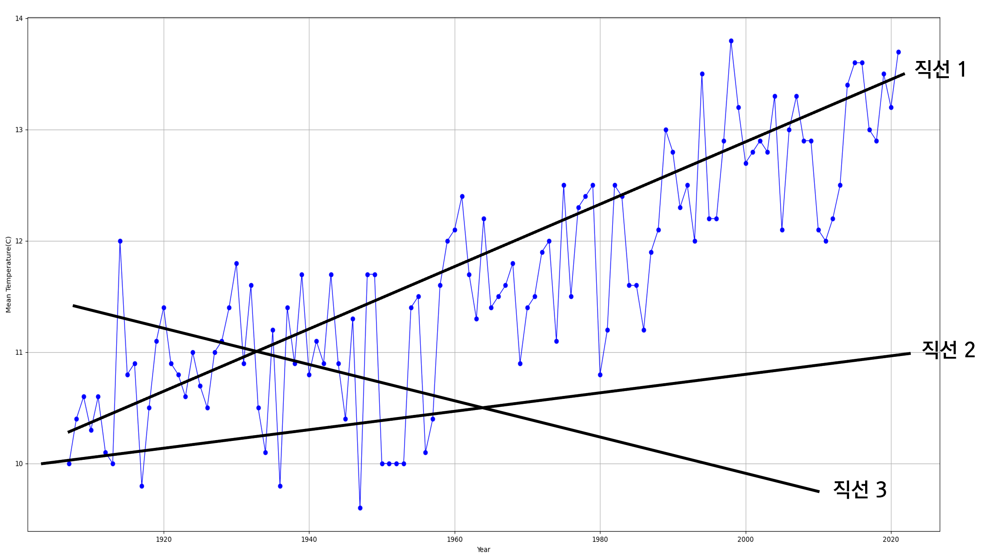

Ⅰ. 서론
-------------
  ‘생각하는’, ‘미래를 예측하는’ 인공지능에 관한 기술은 여전히 개발이 이루어지고 있고, 새로운 인공지능이 끊임없이 나오고 있다. 그림을 그리는 인공지능인 ‘Stable Diffusion’, 글을 써주는 ‘Chat GPT’ 등 여러 인공지능이 대표적인 예시이다. 이들의 발전은 매우 빠른 속도로 이루어지고 있고, 이런 기술이 등장하는 사회에서 프로그래머라면, 심지어 일반인이더라도 이들의 구조를 아는 것이 필요하다.

  발표자는 1학년 교과 ‘과학탐구실험’에서 ‘인공지능을 이용한 한반도의 기후 변화 경향성’이라는 주제로, 2학년 교과 ‘지구과학 1’에서 ‘LSTM을 이용한 미래 기온 예측’을 주제로 발표한 적이 있었다. 이들 모두 데이터를 직접 수집하고 분석 및 정제하여 모델을 구축해 결과값을 계산하였으나, ‘과학탐구실험’에서는 단순한 선형 회귀를 이용한 경향성 파악에 그쳤고, ‘지구과학 1’에서는 딥러닝 모델의 한 종류인 LSTM을 사용하여 미래의 기후를 예측하였으나 직접 처음부터 구축한 모델이 아닌 Tensorflow에서 제공하는 도구를 응용한 것이었다.

  두 경우 모두 사용 가능한 딥러닝 모델을 직접 구축하지 않았다는 점에서 아쉬운 부분이 많았다. 그렇기에 이들을 바탕으로 하여 직접 딥러닝 모델을 수학적으로 이해 및 구축하고, 딥러닝의 모방 대상인 실제 인간의 뉴런과의 차이점, 유사점은 무엇인지 알아보기로 하였다. 교과 ‘생명과학 1’에서 학습했던 뉴런과 뇌를 비롯한 신경계의 특징과 인공신경망을 서로 비교하면서 이해하면 두 개 모두에 대한 더 깊은 이해가 가능할 것이라고 생각했다.

  개인적으로 ‘생명과학 1’에서 뉴런에 대해 배우다 보면, 이처럼 단순히 자극을 서로에게 전달할 뿐인 뉴런들이 어떻게 복잡하게 구성되어 짜여 있기에 인간의 생각을 구성하는지에 대한 궁금증이 계속 있었다. 단순한 뉴런과 복잡한 생각 사이를 연결하는 것은 대체 무엇이고, 아직 정확히 밝혀지지도 않은 인간의 뇌 구조를 인공신경망이 어떤 구조로 모방하는지 또한 항상 궁금해했었다.

  이번 기회에 이러한 궁금증을 해결하기 위해 인공신경망과 인공지능에 대한 수학적 이해와 생물학적 뉴런의 비교를 통해 그 특성을 더 잘 이해하고, 이를 바탕으로 사람이 손으로 작성한 필기체로 되어 있는 숫자가 어떤 숫자인지 구분할 수 있는 인공신경망을 Tensorflow와 같은 다른 편리한 도구를 이용하지 않고 직접 구축하기로 하였다.

Ⅱ. 인공신경망
-------------

1. 인공신경망

인공신경망(Artificial Neural Network, ANN)은 생물학의 신경망 중 특별히 동물의 중추신경계, 즉 뇌에서 영감을 얻은 알고리즘이다. 인공신경‘망(Network)’의 이름에서 알 수 있듯이, 인공신경망은 여러 개의 노드(node)들이 망(network) 구조로 연결되어 구성된다.

이러한 하나의 노드(node)는 생물의 뉴런에서 영감을 받은 것이다. 하나의 노드는 일반적으로 기계학습에서 사용되는 알고리즘 중 하나인 ‘로지스틱 회귀(Logistic Regression)’로 구성된다. 로지스틱 회귀란 선형 회귀(Linear Regression)를 [^1] 이용하여 데이터가 어떤 범주에 속할지 분류(Classification)하는 알고리즘이다.

선형 회귀는 아래 식으로 표현할 수 있다. 어떠한 입력 데이터 $x$에 대하여 예측값 $z$는,

 
 $z=Wx+b$ (식 1) 
 

이때 $W$는 가중치(Weight)이고, $b$는 편향도(Bias)이다. 가중치 $W$와 편향도 $b$는 컴퓨터가 기계학습을 통해 계산해나가며 최적의 값을 찾는 대상이므로, 식 1은 $x->z$인 함수로 생각할 수 있다. 이때 이 함수의 형태는 $W$에 $x$를 곱하고 $b$를 더한 일차함수, 즉 직선(line)의 형태로 나타난다. 수학적으로 $W$는 기울기, $b$는 y 절편이라고 생각할 수 있다.

입력 데이터 $x$에 대하여 이 데이터를 ‘얼마나’ 반영할지 결정하기 위해 가중치 $W$를 곱하여 결정하고, 데이터의 전체적인 값의 ‘치우침’을 결정하기 위해 편향도 $b$를 더하여 값 $z$를 계산한다.

 

[그림 1. 선형 회귀]

예를 들어, 그림 1과 같이 파란색의 데이터 모음에 대하여 이 데이터의 경향성을 나타내려는 3개의 직선이 있다고 하자. 이들 중 파란색 데이터의 경향성, 즉 증가하는 방향성을 가장 잘 나타내는 직선은 직선 1임이 명백하다. 컴퓨터는 이를 계산하기 위해 가중치와 편향도, 즉 기울기와 y 절편을 아주 조금씩 바꾸어가며 이에 따라 오차가 어느 정도 변하는지를 계산, 즉 수치미분을 이용하여 최적의 기울기와 y 절편을 찾아 나간다.

로지스틱 회귀는 식 1과 함께 아래와 같이 나타낼 수 있다.

 
 $y=f(z)$ (식 2) 
 

이때 $b$는 프로그래머가 미리 설정한 활성화 함수이다. 활성화함수는 시그모이드(sigmoid) 함수[^2], 렐루(ReLU) 함수[^3] 등 여러 가지가 존재하며, 어떤 활성화함수를 사용할지는 프로그래머가 설정함에 따라 달라진다.

로지스틱 회귀는 식 1을 통해 계산된 $z$의 값을 활성화함수 $f$에 넣고 계산한 후, 그 값을 활성화함수 종류에 따라 값의 범위를 지정하여 최종값의 범주를 정하는 것으로 해결된다.

[^1]: 어떤 데이터 모음의 경향성을 가장 잘 나타내는 직선(line)을 찾는 알고리즘을 ‘선형(linear) 회귀’라 한다.
[^2]: $y={1 \over (1+e^{-x})}$
[^3]: $y=max(0,x)$